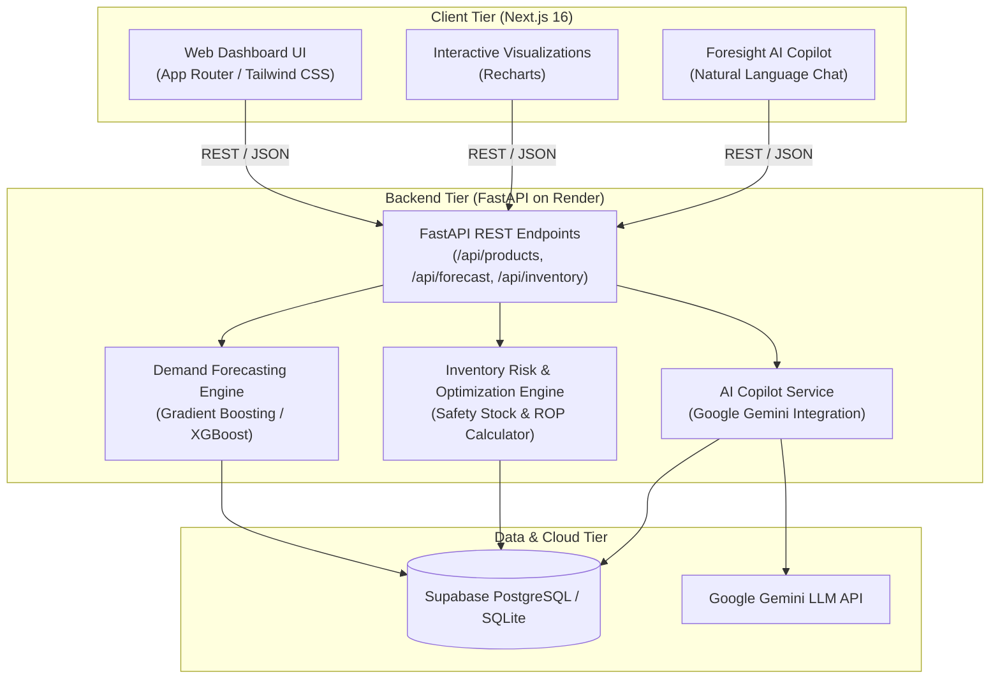

# 🔮 PROJECT FORESIGHT: AI-Powered Demand & Inventory Intelligence Platform

[](https://project-foresight-frontend.vercel.app)
[](https://project-foresight-hkov.onrender.com/health)
[](https://project-foresight-hkov.onrender.com/docs)
[](https://www.python.org/)
[-black?style=flat-square&logo=next.js)](https://nextjs.org/)
[](https://fastapi.tiangolo.com/)
[](https://ai.google.dev/)

**Project FORESIGHT** is a full-stack, enterprise-grade demand forecasting and inventory optimization platform. It converts raw transactional retail sales history into actionable SKU-level demand predictions, quantifies stockout and overstock risks, computes statistical Reorder Points ($ROP$) and Safety Stock ($SS$), and delivers automated purchase order recommendations alongside a real-time **Google Gemini AI Supply Chain Copilot**.

---

## 🌐 Live Deployments

| Component | Platform | URL |
| :--- | :--- | :--- |
| **Frontend Application** | Vercel | [**https://project-foresight-frontend.vercel.app**](https://project-foresight-frontend.vercel.app) |
| **Backend REST API** | Render | [**https://project-foresight-hkov.onrender.com**](https://project-foresight-hkov.onrender.com) |
| **Interactive API Docs** | Render | [**https://project-foresight-hkov.onrender.com/docs**](https://project-foresight-hkov.onrender.com/docs) |
| **Health Check Endpoint** | Render | [**https://project-foresight-hkov.onrender.com/health**](https://project-foresight-hkov.onrender.com/health) |

---

## 🏗️ System Architecture



---

## 🌟 Core Modules & Capabilities

### 1. 📊 Executive Intelligence Dashboard
- High-level KPIs: Active SKUs, Total Physical Inventory, 30-Day Sales Volume, 30-Day Revenue, and Recommended Purchase Value.
- Dynamic 30-day interactive sales trend charts and revenue distribution across retail categories.
- Real-time risk distribution: Critical Risk, Warning, Healthy, and Overstock item counts.

### 2. 📈 Multi-Horizon SKU Demand Forecasting
- Predictive time-series forecasting across 7, 14, and 30-day horizons.
- Gradient Boosting with engineered temporal features: rolling means (7d, 14d, 30d), lag variables, day-of-week seasonality, and trend indicators.
- Confidence intervals ($\pm 1.96 \times \text{RMSE}$) and accuracy metrics (MAE, RMSE, MAPE).

### 3. 🎯 Inventory Risk Matrix & Formula Engine
- **Lead Time Demand ($LTD$)**:
  $$\text{LTD} = \bar{D} \times L$$
- **Statistical Safety Stock ($SS$)**:
  $$SS = Z \times \sigma_L = Z \times \sqrt{L \cdot \sigma_D^2}$$
  *(where $Z = 1.65$ for 95% service level)*
- **Reorder Point ($ROP$)**:
  $$ROP = \text{LTD} + SS$$
- **Dynamic Days to Stockout**:
  $$\text{Days to Stockout} = \frac{\text{Current Stock}}{\bar{D}}$$

### 4. 🛒 Automated Purchase Order Recommendations
- Computes exact replenishment quantities:
  $$\text{Quantity} = \max(0, ROP + \text{Demand}_{30d} - \text{Current Stock})$$
- Generates itemized POs with estimated procurement budget and supplier details.

### 5. 🤖 Ask FORESIGHT AI (Gemini Copilot)
- Real-time natural language supply chain advisor powered by **Google Gemini**.
- Answers ad-hoc inventory questions grounded directly in live catalog and stock records.
- Actionable advice for mitigating stockouts, clearing overstock, and optimizing purchasing schedules.

### 6. 📁 Data Management & CSV Ingestion
- Upload custom retail transaction CSV/XLSX files.
- Automated validation, schema alignment, and re-calculation of risks upon ingestion.
- 1-click sample retail dataset seeder for quick demos.

---

## 🛠️ Technology Stack

| Layer | Technology | Details |
| :--- | :--- | :--- |
| **Frontend** | Next.js 16, React 19, TypeScript | Server & Client Components, App Router |
| **Styling** | Tailwind CSS, Lucide Icons | Responsive modern dark/light glassmorphic UI |
| **Charts** | Recharts | Interactive time-series & category breakdowns |
| **Backend** | Python 3.10+, FastAPI, Uvicorn | High-throughput asynchronous REST API |
| **Machine Learning** | Scikit-Learn, Pandas, NumPy | Gradient Boosting, rolling feature extraction |
| **LLM / AI** | Google Gemini | Real-time supply chain context generation |
| **Database** | PostgreSQL (Supabase) / SQLite | SQLAlchemy 2.0 ORM with relational mapping |
| **Deployment** | Render (Backend), Vercel (Frontend) | Continuous Deployment from GitHub |

---

## 📡 REST API Reference

| Method | Endpoint | Description |
| :--- | :--- | :--- |
| `GET` | `/health` | Server status and health check |
| `GET` | `/api/products` | Retrieve all monitored product SKUs |
| `GET` | `/api/products/{sku_id}` | Get product details by SKU ID |
| `GET` | `/api/dashboard/summary` | Aggregate executive KPIs and risk counts |
| `GET` | `/api/dashboard/charts/sales-trend` | 30-day historical sales and revenue trends |
| `GET` | `/api/dashboard/charts/category-demand` | Category-wise unit sales and revenue distribution |
| `GET` | `/api/inventory/risk-matrix` | Full inventory risk calculation for all SKUs |
| `GET` | `/api/inventory/recommendations` | Filtered purchase order replenishment suggestions |
| `GET` | `/api/forecast/{sku_id}?days=30` | 30-day forward demand forecast with confidence bounds |
| `POST` | `/api/assistant/query` | Ask natural language inventory questions to Gemini AI |
| `POST` | `/api/upload/csv` | Ingest and parse sales history CSV dataset |
| `POST` | `/api/upload/seed` | Seed default retail sales and inventory dataset |

---

## 💻 Local Development Setup

### 1. Prerequisites
- **Python 3.10+**
- **Node.js 18+**
- **Git**

### 2. Backend Setup
```bash
# Navigate to backend directory
cd backend

# Create & activate virtual environment
python -m venv venv
# On Windows:
venv\Scripts\activate
# On macOS/Linux:
source venv/bin/activate

# Install dependencies
pip install -r requirements.txt

# Start FastAPI development server
uvicorn app.main:app --host 0.0.0.0 --port 8000 --reload
```
Interactive Swagger documentation is available at: [http://localhost:8000/docs](http://localhost:8000/docs).

### 3. Backend Configuration

Copy `backend/.env.example` to `backend/.env` and configure the values for your environment. The backend uses SQLite locally by default and can use PostgreSQL in production through `DATABASE_URL`.

```env
DATABASE_URL=sqlite:///./foresight.db
CORS_ORIGINS=http://localhost:3000
GEMINI_API_KEY=your_optional_gemini_key
```

`CORS_ORIGINS` accepts a comma-separated list. On Render, set `DATABASE_URL`, `GEMINI_API_KEY`, and `CORS_ORIGINS` in the service environment rather than committing secrets.

The API initializes its tables on startup. Uploading or seeding data imports transactions, recalculates inventory risks and recommendations, and trains SKU forecasts from the stored sales history.

### 4. Frontend Setup
```bash
# In a new terminal, navigate to frontend directory
cd frontend

# Install npm packages
npm install

# Start Next.js development server
npm run dev
```
Open [http://localhost:3000](http://localhost:3000) in your browser.

To point the frontend to a local or alternate backend, set `NEXT_PUBLIC_API_URL` to that API's `/api` URL (for example, `http://localhost:8000/api`).

---

## 📂 Project Structure

```text
Project FORESIGHT/
├── backend/
│   ├── api/
│   │   └── index.py            # ASGI entrypoint for serverless runtimes
│   ├── app/
│   │   ├── api/                # Modular FastAPI router endpoints
│   │   │   ├── ai_assistant.py
│   │   │   ├── dashboard.py
│   │   │   ├── forecast.py
│   │   │   ├── inventory.py
│   │   │   ├── products.py
│   │   │   └── upload.py
│   │   ├── core/               # App configuration & database session
│   │   ├── ml/                 # Feature engineering & demand forecaster
│   │   ├── models/             # SQLAlchemy ORM models & Pydantic schemas
│   │   ├── services/           # AI copilot & inventory risk engine
│   │   └── main.py             # Primary FastAPI application entrypoint
│   ├── data/                   # Sample retail sales dataset & generator
│   ├── Procfile                # Web process configuration for Render
│   └── requirements.txt        # Python backend dependencies
│
├── frontend/
│   ├── public/                 # Static assets and icons
│   ├── src/
│   │   ├── app/                # Next.js App Router pages
│   │   │   ├── assistant/      # AI Copilot interactive chat interface
│   │   │   ├── forecast/       # Time-series demand forecasting view
│   │   │   ├── inventory/      # Risk Matrix and stockout monitoring
│   │   │   ├── products/       # Product catalog and SKU detail views
│   │   │   ├── recommendations/# Automated purchase order generation
│   │   │   └── upload/         # CSV dataset upload & seeder
│   │   ├── components/         # Reusable UI cards, tables, charts & navigation
│   │   └── lib/                # API client connector & TypeScript types
│   ├── package.json
│   └── tsconfig.json
│
├── docs/                       # Project report, video script & documentation
├── render.yaml                 # Render infrastructure-as-code blueprint
└── README.md                   # Project documentation
```

---

## 📄 License & Attribution

Built for enterprise retail demand intelligence and supply chain optimization.  
Developed by **Shaik Muzamil** & the **Project FORESIGHT Team**.
